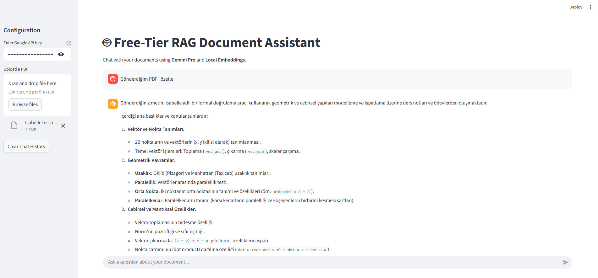
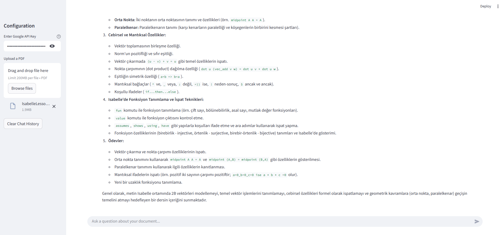
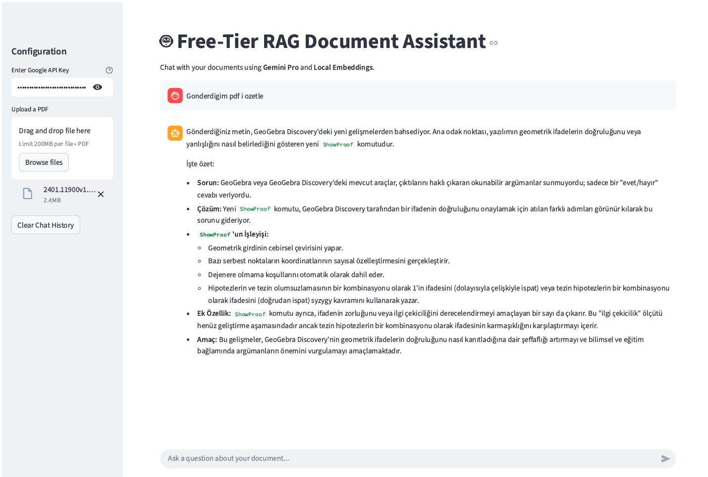
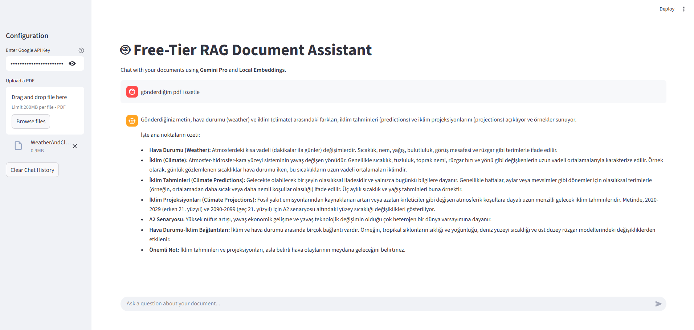

# 🤖 Free-Tier RAG Document Assistant

Online demo https://efe-arslan-rag.streamlit.app/

> **Chat with your PDFs for free.** No subscriptions, no hidden costs.  
> Built with **Google Gemini (Free Tier)**, **LangChain**, and **Streamlit**.



## 🌟 Features

*   **100% Free Architecture**: Uses Google's generous free-tier API (Gemini 1.5/2.5 Flash) and runs embedding models locally on your CPU.
*   **Privacy-First**: Your API Key stays on your machine. Documents are processed locally in RAM (FAISS).
*   **Easy Setup**: Includes auto-configuration scripts to handle API models.
*   **User Friendly**: Clean "Upload & Chat" interface.

## 📸 Demo Gallery

| Querying Document | Detailed Responses |
| :---: | :---: |
|  |  |
| **Follow-up Questions** | **Reasoning Capabilities** |
|  |  |

## 🚀 Installation & Usage

### Prerequisites
1.  **Python 3.9** or higher.
2.  A **Google Cloud API Key** (Get one for free at [Google AI Studio](https://aistudio.google.com/)).

### Quick Start (Windows)
1.  **Clone the Repo**:
    ```bash
    git clone https://github.com/your-username/Free-Tier-RAG-Assistant.git
    cd Free-Tier-RAG-Assistant
    ```
2.  **Run the Setup**:
    Double-click `run_app.bat`. 
    *(It will create a virtual environment, install libraries, and launch the app.)*

    > **Note**: If you see a "Model not found" error, simply run `check_models.bat` and paste your API Key. It will automatically update the code to use the correct model available to you.

### Manual Installation
```bash
# 1. Create venv
python -m venv .venv
source .venv/bin/activate  # or .\.venv\Scripts\activate on Windows

# 2. Install
pip install -r requirements.txt

# 3. Run
streamlit run app.py
```

## 🛠️ Technical Stack
*   **LLM**: Google Gemini 1.5 Flash / 2.5 Flash / Pro
*   **Embeddings**: `sentence-transformers/all-MiniLM-L6-v2` (Local, HuggingFace)
*   **Vector Store**: FAISS (CPU)
*   **Orchestration**: LangChain
*   **UI**: Streamlit

## 📄 License
This project is licensed under the [MIT License](LICENSE).

---
*Created for the Open Source Community.*
